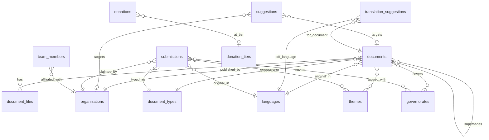
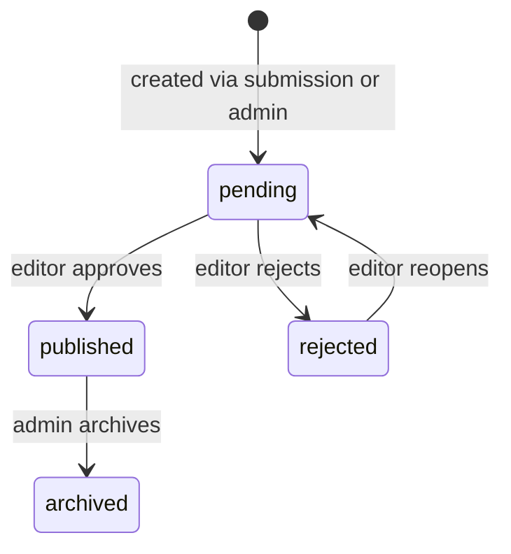
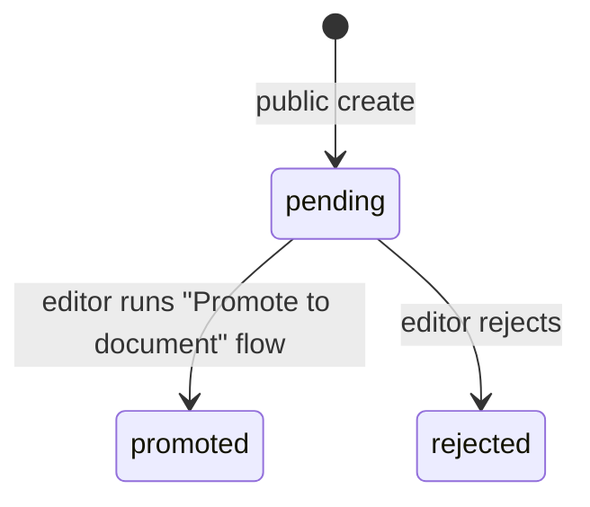
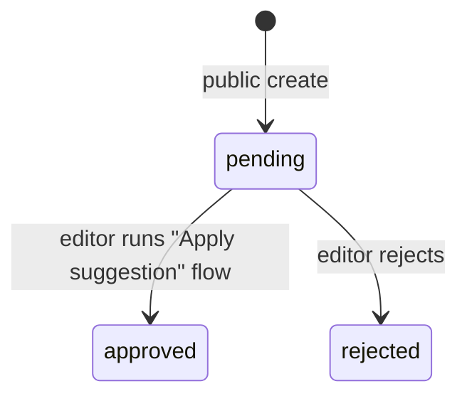
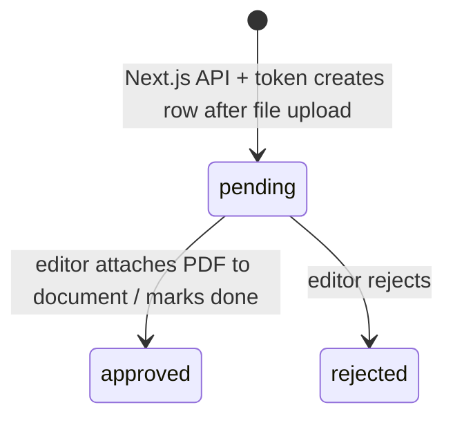
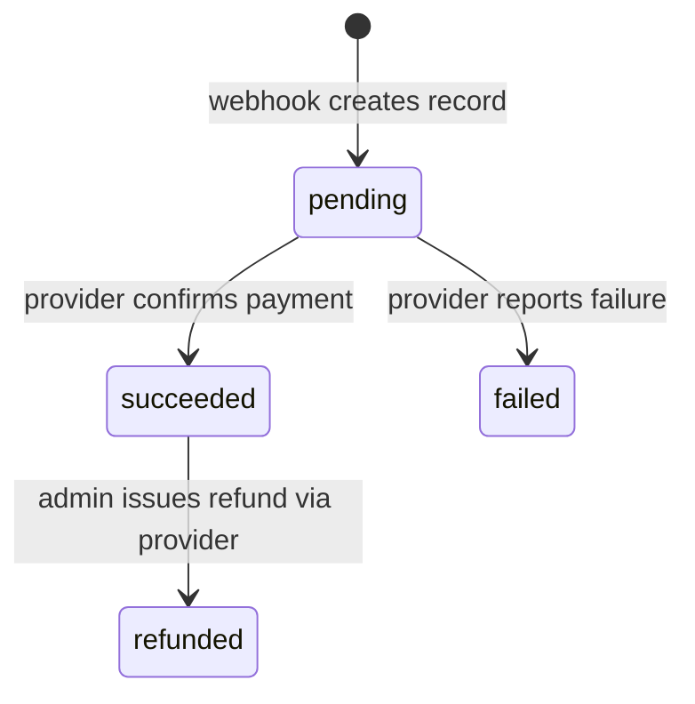

# Roufouf — Directus Schema Specification

> **What this document is.** The authoritative written spec for every Directus
> collection, field, relationship, permission, and admin-panel configuration
> that Roufouf depends on. If the code and this file disagree, this file wins;
> update whichever one is out of date.
>
> **Who should read it.** Anyone setting up a Directus instance for Roufouf,
> reviewing the data model, or writing frontend code that needs to know the
> shape of an API response. Non-technical admins should read `ADMIN_GUIDE.md`
> instead; it is written in plain language and covers the same workflows.

---

## Table of contents

1. [Conventions](#1-conventions)
2. [Collections overview](#2-collections-overview)
3. [Entity-relationship diagram](#3-entity-relationship-diagram)
4. [Taxonomy collections](#4-taxonomy-collections)
5. [Core collections](#5-core-collections)
6. [User-contribution collections](#6-user-contribution-collections)
7. [Partners, donations, leads](#7-partners-donations-leads)
8. [Editorial collections](#8-editorial-collections)
9. [Permissions matrix](#9-permissions-matrix)
10. [Status workflows](#10-status-workflows)
11. [PostgreSQL requirements](#11-postgresql-requirements)
12. [Directus admin-console configuration](#12-directus-admin-console-configuration)
13. [Setup recipe](#13-setup-recipe)

---

## 1. Conventions

- **Primary keys**: every collection uses `id` as an auto-generated UUID
  (Directus default). Exceptions are called out explicitly.
- **Timestamps**: `date_created` and `date_updated` are auto-populated by
  Directus on every collection that has user-visible history. Listed per
  collection as `auto`.
- **Translations**: every user-facing taxonomy value has three separate fields
  (`name_ar`, `name_fr`, `name_en`). Long prose that can be translated into any
  locale uses a JSON field keyed by locale (`{ ar, fr, en, other }`).
- **Soft delete**: `status = archived` is used instead of hard deletion
  wherever user-generated or publicly-displayed content is involved.
- **Slugs**: short, URL-safe, lowercase, hyphenated. Generated from the English
  name on create, editable after. Must be unique within their collection.
- **File fields**: all file references use Directus's built-in File abstraction
  (a UUID pointing at `directus_files`). The frontend composes URLs via the
  Directus asset endpoint.
- **Enum fields**: stored as strings, validated at the application layer. The
  allowed values are fixed in this document.

---

## 2. Collections overview

| Collection          | Purpose                                                | Public read                   | Public create |
| ------------------- | ------------------------------------------------------ | ----------------------------- | ------------- |
| `documents`         | Published reports, briefs, studies                      | `status = published`          | No            |
| `document_files`    | One or more PDFs per document (summary + full + annex)  | Linked docs only              | No            |
| `organizations`     | CSOs that publish documents                             | All                           | No            |
| `themes`            | Taxonomy: thematic areas (Governance, Gender, …)        | All                           | No            |
| `document_types`    | Taxonomy: policy brief, research report, …              | All                           | No            |
| `governorates`      | Taxonomy: the 24 Tunisian governorates                  | All                           | No            |
| `languages`         | Taxonomy: core + seven common languages + Other (§4.4)  | All                           | No            |
| `suggestions`       | User-submitted field corrections                        | No                            | Yes           |
| `translation_suggestions` | User-submitted translated PDF for an existing document | No                            | No\*          |
| `submissions`       | Public document upload requests                         | No                            | Yes           |
| `contact_messages`  | Inbound contact-form messages                           | No                            | Yes           |
| `team_members`      | People on the About page                                | All                           | No            |
| `pages`             | Singleton: mission, impact callouts, static copy        | All                           | No            |
| `partners`          | Institutional supporters/funders                        | `is_active && display_on_homepage` | No        |
| `donation_tiers`    | Admin-curated suggested donation amounts                | `is_active`                   | No            |
| `donations`         | Recorded donations (written by payment webhook)         | Strict filtered view only*    | No            |
| `donation_leads`    | Donation interest captured before payments are live     | No                            | Yes           |

\* The public donors-wall view returns only `public_display_name` (or
`donor_name` when that is not set) and the month component of `date_created`,
strictly filtered to `status = succeeded AND is_anonymous = false AND
display_on_homepage = true`. Amount, email, message, provider, and
`provider_reference` are never exposed publicly.

\* **`translation_suggestions`:** Rows are created only by the Next.js API
(`POST /api/translation-suggestions`) using `DIRECTUS_TOKEN` after uploading
the PDF to `directus_files`. The Public role has no Directus create access on
this collection.

---

## 3. Entity-relationship diagram



---

## 4. Taxonomy collections

All taxonomies share the same shape: a stable numeric/UUID `id`, a URL `slug`,
and three localized name fields. The frontend picks the right `name_*` based on
the active UI locale via `useTaxonomyLabel()`.

### 4.1 `themes`

| Field      | Type      | Required | Notes                                              |
| ---------- | --------- | -------- | -------------------------------------------------- |
| `id`       | uuid (pk) | auto     |                                                    |
| `slug`     | string    | yes      | Unique. URL-safe.                                   |
| `name_ar`  | string    | yes      | Arabic display name.                                |
| `name_fr`  | string    | yes      | French display name.                                |
| `name_en`  | string    | yes      | English display name.                               |
| `sort_order` | integer | no       | Drag-and-drop ordering in the admin panel.          |

Seed data (examples, not exhaustive — admins extend freely):

- Governance / الحوكمة / Gouvernance
- Human Rights / حقوق الإنسان / Droits humains
- Gender / النوع الاجتماعي / Genre
- Environment / البيئة / Environnement
- Media / الإعلام / Médias

### 4.2 `document_types`

Same shape as `themes`.

Seed data:

- Policy Brief / موجز سياسات / Note de politique
- Research Report / تقرير بحثي / Rapport de recherche
- Monitoring Study / دراسة رصد / Étude de suivi
- Survey / استطلاع / Enquête

### 4.3 `governorates`

Same shape as `themes`, **pre-seeded** with all 24 Tunisian governorates.

| slug           | name_ar      | name_fr        | name_en        |
| -------------- | ------------ | -------------- | -------------- |
| ariana         | أريانة       | Ariana         | Ariana         |
| beja           | باجة         | Béja           | Beja           |
| ben-arous      | بن عروس      | Ben Arous      | Ben Arous      |
| bizerte        | بنزرت        | Bizerte        | Bizerte        |
| gabes          | قابس         | Gabès          | Gabes          |
| gafsa          | قفصة         | Gafsa          | Gafsa          |
| jendouba       | جندوبة       | Jendouba       | Jendouba       |
| kairouan       | القيروان     | Kairouan       | Kairouan       |
| kasserine      | القصرين      | Kasserine      | Kasserine      |
| kebili         | قبلي         | Kébili         | Kebili         |
| kef            | الكاف        | Le Kef         | Kef            |
| mahdia         | المهدية      | Mahdia         | Mahdia         |
| manouba        | منوبة        | La Manouba     | Manouba        |
| medenine       | مدنين        | Médenine       | Medenine       |
| monastir       | المنستير     | Monastir       | Monastir       |
| nabeul         | نابل         | Nabeul         | Nabeul         |
| sfax           | صفاقس        | Sfax           | Sfax           |
| sidi-bouzid    | سيدي بوزيد   | Sidi Bouzid    | Sidi Bouzid    |
| siliana        | سليانة       | Siliana        | Siliana        |
| sousse         | سوسة         | Sousse         | Sousse         |
| tataouine      | تطاوين       | Tataouine      | Tataouine      |
| tozeur         | توزر         | Tozeur         | Tozeur         |
| tunis          | تونس         | Tunis          | Tunis          |
| zaghouan       | زغوان        | Zaghouan       | Zaghouan       |

### 4.4 `languages`

Same shape as `themes`. Pre-seeded with Arabic, French, English, seven widely
used additional languages (Spanish through Chinese), then **Other** as the
catch-all (keep **Other** last in `sort_order`).

| slug    | name_ar      | name_fr    | name_en     |
| ------- | ------------ | ---------- | ----------- |
| ar      | العربية      | Arabe      | Arabic      |
| fr      | الفرنسية     | Français   | French      |
| en      | الإنجليزية   | Anglais    | English     |
| es      | الإسبانية    | Espagnol   | Spanish     |
| it      | الإيطالية    | Italien    | Italian     |
| de      | الألمانية    | Allemand   | German      |
| tr      | التركية      | Turc       | Turkish     |
| pt      | البرتغالية   | Portugais  | Portuguese  |
| ru      | الروسية      | Russe      | Russian     |
| zh      | الصينية      | Chinois    | Chinese     |
| other   | أخرى         | Autre      | Other       |

---

## 5. Core collections

### 5.1 `documents`

The main record.

| Field                   | Type                         | Required | Notes                                                                                                          |
| ----------------------- | ---------------------------- | -------- | -------------------------------------------------------------------------------------------------------------- |
| `id`                    | uuid (pk)                    | auto     |                                                                                                                |
| `title`                 | string                       | yes      | Appears in the document's original language.                                                                   |
| `author`                | string                       | no       | Free text. Use the organization name when no individual is named.                                              |
| `organization`          | M2O → `organizations`        | no       | Publishing organization. Nullable because some historic docs have no known org.                                |
| `date_published`        | date                         | no       | Original publication date. Missing → citations render `n.d.`.                                                  |
| `abstract_original`     | text                         | no       | Abstract in the document's original language.                                                                  |
| `abstract_translations` | json                         | no       | `{ ar?: string, fr?: string, en?: string, other?: string }`. UI prefers the active locale, falls back to `abstract_original`. |
| `language`              | M2O → `languages`            | no       | Original language of the document.                                                                             |
| `themes`                | M2M → `themes`               | no       | Via `documents_themes` junction.                                                                               |
| `document_type`         | M2O → `document_types`       | no       |                                                                                                                |
| `governorates`          | M2M → `governorates`         | no       | Via `documents_governorates` junction.                                                                         |
| `keywords`              | json (array of string)       | no       | Free-text tags. Normalized lowercase for search but displayed as entered.                                      |
| `source_url`            | string                       | no       | Canonical URL of the document on the publisher's site (https preferred). Shown on the detail page when set.   |
| `supersedes`            | M2O → `documents` (self-ref) | no       | The document this one replaces. The superseded document shows a "newer version" banner linking here.           |
| `pdf_public_display`    | string (enum)                | yes      | `auto \| original \| optimized`. Default **`auto`**. Controls which PDF asset the **public** site uses for the viewer and download links (original vs machine-optimized derivative). See **§5.1.1**. Does **not** affect the background optimizer: derivatives are produced regardless so editors can switch modes. |
| `files`                  | json (array)                  | yes      | Attached PDF slots for this deployment (stored as JSON on the row; see **`scripts/seed.ts`**). Canonical publisher file per slot lives in **`file`**; **`optimized_file`** holds an optional derivative. See **§5.1.1**.                         |
| `file_hash`             | string (hex)                 | yes      | SHA-256 of the primary file. Used for exact-duplicate detection.                                               |
| `content_fingerprint`   | text                         | yes      | Normalized first 2,000 words of extracted PDF text. Used for fuzzy-duplicate detection via `pg_trgm`.          |
| `status`                | enum                         | yes      | `pending \| published \| rejected \| archived`. Default `pending`.                                             |
| `date_uploaded`         | datetime                     | auto     | When the record was created in Directus.                                                                       |
| `date_created`          | datetime                     | auto     | Directus audit field.                                                                                          |
| `date_updated`          | datetime                     | auto     | Directus audit field.                                                                                          |

**Junction tables**

- `documents_themes` (`document_id`, `theme_id`)
- `documents_governorates` (`document_id`, `governorate_id`)

#### 5.1.1 `files` JSON slots (stored on `documents`)

For the seeded schema, attachments are **`documents.files`**: an array of objects. Dedup hashes on the **`documents`** row (`file_hash`, `content_fingerprint`) remain tied to the **publisher original** ingestion only; optimizing does not rewrite them.

Each element may include:

| Key | Type | Notes |
| --- | ---- | ----- |
| `id` | string | Stable slot id (e.g. `docfile-…`). |
| `kind` | string | `main \| executive_summary \| annex \| dataset` (must match **`DocumentFileKind`** in `types/directus.ts`). Exactly one **`main`** per document. |
| `file` | object | Required. Original PDF as a **`directus_files`** projection: **`id`**, **`url`**, **`filename`**, **`mime_type`**, … |
| `optimized_file` | object | Optional. Compressed derivative (**`POST /files`**); same projection shape as **`file`** for parity. Both ids appear in Admin → File Library. |
| `optimization_status` | string | **`pending`** \| **`processing`** \| **`ready`** \| **`failed`** \| **`skipped`**. Workflow field written by **`pdf-optimize-worker`**. Missing on legacy rows ⇒ treat as **`pending`** for eligibility. |
| `optimization_error` | string \| null | Short diagnostic when **`failed`**. |
| `optimized_at` | ISO8601 string | Optional. Set when a derivative becomes **`ready`**. |
| `label_ar` / `label_fr` / `label_en` | string | Optional display labels per locale. |

**Public resolution** applies **`documents.pdf_public_display`** to each slot (`auto` prefers **`optimized_file`** when **`optimization_status === 'ready'`**, else **`original`** (`file`); other modes are described in **`resolvePublicPdfFile`**, `lib/pdf/resolvePublicPdfFile.ts`).

**Directus admin (MVP)**

- **`pdf_public_display`** — Dropdown: *Automatic (optimized when ready)* ⇒ `auto`; *Always show original PDF* ⇒ `original`; *Prefer optimized (fallback to original)* ⇒ `optimized`.
- **`files`** — Field Note: **`file`** = publisher-original PDF; **`optimized_file`** (when present) = machine derivative; **`optimization_*`** slots are maintained by **`pdf-optimize-worker`**. Editors can edit JSON for labels and slot ids; uploads use standard File flows.

Relational **`document_files`** (§5.2 below) describes an alternative normalized shape **not** used by this app’s seeded Directus wiring.

### 5.2 `document_files`

One document can ship with several PDFs — typically an executive summary plus
the full report plus annexes or datasets. The first `main` file is the one
whose hash and fingerprint are recorded on the parent `documents` row and used
for dedup.

| Field         | Type                 | Required | Notes                                                                                 |
| ------------- | -------------------- | -------- | ------------------------------------------------------------------------------------- |
| `id`          | uuid (pk)            | auto     |                                                                                       |
| `document`    | M2O → `documents`    | yes      |                                                                                       |
| `file`        | File                 | yes      | Directus file reference.                                                              |
| `kind`        | enum                 | yes      | `main \| executive_summary \| annex \| dataset`. Exactly one `main` per document.     |
| `label_ar`    | string               | no       | Display label in Arabic.                                                              |
| `label_fr`    | string               | no       | Display label in French.                                                              |
| `label_en`    | string               | no       | Display label in English.                                                             |
| `sort_order`  | integer              | no       | Display order on the document detail page.                                            |

### 5.3 `organizations`

| Field             | Type       | Required | Notes                                                                                               |
| ----------------- | ---------- | -------- | --------------------------------------------------------------------------------------------------- |
| `id`              | uuid (pk)  | auto     |                                                                                                     |
| `slug`            | string     | yes      | Unique URL slug. Used in `/organizations/[slug]`.                                                   |
| `name`            | string     | yes      | Canonical (English/Latin) name.                                                                     |
| `name_ar`         | string     | no       | Arabic name.                                                                                        |
| `name_fr`         | string     | no       | French name.                                                                                        |
| `name_en`         | string     | no       | English name.                                                                                      |
| `description`     | text       | no       | Localized via three optional fields below, but a single default description is also supported.      |
| `description_ar`  | text       | no       |                                                                                                     |
| `description_fr`  | text       | no       |                                                                                                     |
| `description_en`  | text       | no       |                                                                                                     |
| `website`         | string     | no       | Full URL.                                                                                           |
| `logo`            | File       | no       | SVG preferred; PNG ≥ 512×512 with transparent background.                                           |
| `contact_email`   | string     | no       |                                                                                                     |
| `contact_phone`   | string     | no       |                                                                                                     |
| `contact_address` | text       | no       |                                                                                                     |
| `is_verified`     | boolean    | yes      | Default `false`. Editorial trusted-organization badge. **Admin-only write.**                         |
| `status`          | enum       | yes      | `active \| archived`. Default `active`.                                                             |
| `date_created`    | datetime   | auto     |                                                                                                     |
| `date_updated`    | datetime   | auto     |                                                                                                     |

**Verified flag semantics.** `is_verified = true` surfaces a small inline
checkmark badge next to the organization name anywhere it appears in the UI
(document card, document detail, organization profile). Editorial staff enable
it only after confirming the organization's identity and legitimacy via the
process documented in `ADMIN_GUIDE.md`. Every toggle is recorded in the Directus
Activity Log with the admin's user ID and timestamp.

---

## 6. User-contribution collections

### 6.1 `suggestions`

User-submitted metadata corrections. Applies to both documents and
organizations via `target_type`.

| Field                | Type                         | Required | Notes                                                                                                             |
| -------------------- | ---------------------------- | -------- | ----------------------------------------------------------------------------------------------------------------- |
| `id`                 | uuid (pk)                    | auto     |                                                                                                                   |
| `target_type`        | enum                         | yes      | `document \| organization`.                                                                                        |
| `document_id`        | M2O → `documents`            | no       | Set when `target_type = document`. Null otherwise.                                                                 |
| `organization_id`    | M2O → `organizations`        | no       | Set when `target_type = organization`. Null otherwise.                                                             |
| `suggested_by_email` | string                       | no       | Optional contact so admins can follow up.                                                                          |
| `field_name`         | string                       | yes      | Machine-readable key (e.g. `date_published`). Must match an actual field on the target collection.                  |
| `field_label`        | string                       | yes      | Human-readable label captured at submission time, so the admin UI reads clearly even if the field is later renamed. |
| `current_value`      | text                         | yes      | Snapshot of the value at submission time.                                                                          |
| `suggested_value`    | text                         | yes      | The user's proposed value.                                                                                         |
| `note`               | text                         | no       | Optional explanation.                                                                                              |
| `status`             | enum                         | yes      | `pending \| approved \| rejected`. Default `pending`.                                                              |
| `admin_note`         | text                         | no       | Private admin note on rejection/approval.                                                                          |
| `date_submitted`     | datetime                     | auto     |                                                                                                                   |
| `date_reviewed`      | datetime                     | no       | Set when status changes from `pending`.                                                                             |

**Application flow.** A Directus Flow ("Apply suggestion") reads the
suggestion, finds the target record, writes `suggested_value` to `field_name`,
sets `status = approved` and `date_reviewed = now`, and appends a Directus
Activity Log entry on the target record.

### 6.1a `translation_suggestions`

User-submitted **PDF** of an existing **published** document in another language
(same editorial model as metadata suggestions: pending → approved/rejected).

| Field                 | Type              | Required | Notes                                                                                 |
| --------------------- | ----------------- | -------- | ------------------------------------------------------------------------------------- |
| `id`                  | uuid (pk)         | auto     |                                                                                       |
| `document`            | M2O → `documents` | yes      | Target document.                                                                     |
| `language`            | M2O → `languages` | yes      | Language of the uploaded PDF (not necessarily the site UI language).                  |
| `pdf_file`            | uuid              | yes      | `directus_files.id` produced when the app uploads the PDF before inserting this row. |
| `file_hash`           | text              | yes      | SHA-256 of the PDF bytes (for dedup / audit).                                        |
| `content_fingerprint` | text              | yes      | Same normalized excerpt strategy as `documents` / `submissions`.                     |
| `suggested_by_email`  | string            | no       | Optional contact for follow-up.                                                       |
| `note`                | text              | no       | Optional context for editors.                                                         |
| `status`              | enum              | yes      | `pending \| approved \| rejected`. Default `pending`.                                |
| `admin_note`          | text              | no       | Private note on rejection/approval.                                                   |
| `date_submitted`      | datetime          | auto     |                                                                                       |
| `date_reviewed`       | datetime          | no       | Set when status leaves `pending`.                                                     |

**Creation path.** Public users never POST to Directus for this collection. The
Next.js route `POST /api/translation-suggestions` validates the document
(`status = published`), uploads the file to Directus, then inserts a row here
using the static token.

### 6.2 `submissions`

Public document upload requests. Mirrors the `documents` schema plus submitter
metadata.

| Field                   | Type                         | Required | Notes                                                                 |
| ----------------------- | ---------------------------- | -------- | --------------------------------------------------------------------- |
| All fields from `documents`  | ...                     | ...      | Except `status` (see below). Includes optional `source_url` like `documents`.                                   |
| `submitted_by_name`     | string                       | no       |                                                                       |
| `submitted_by_email`    | string                       | no       |                                                                       |
| `submitted_by_org`      | string                       | no       | Free-text; admins promote to a real `organizations` row on approval.   |
| `batch_id`              | string (uuid)                | no       | Shared across documents submitted together in a bulk session.          |
| `status`                | enum                         | yes      | `pending \| promoted \| rejected`. Default `pending`.                 |
| `admin_note`            | text                         | no       |                                                                       |
| `date_submitted`        | datetime                     | auto     |                                                                       |

**Promotion flow.** A Directus Flow ("Promote to document") copies the
submission onto a new `documents` row with `status = pending` (still requires
final editorial review), links files, and marks the submission
`status = promoted`.

### 6.3 `contact_messages`

| Field           | Type     | Required | Notes                                                                 |
| --------------- | -------- | -------- | --------------------------------------------------------------------- |
| `id`            | uuid (pk) | auto    |                                                                       |
| `name`          | string   | yes      |                                                                       |
| `email`         | string   | yes      |                                                                       |
| `subject`       | string   | no       |                                                                       |
| `message`       | text     | yes      |                                                                       |
| `status`        | enum     | yes      | `new \| read \| replied \| archived`. Default `new`.                 |
| `date_created`  | datetime | auto     |                                                                       |

---

## 7. Partners, donations, leads

### 7.1 `partners`

Institutional supporters. Distinct from `organizations` (which publish
documents): a partner might be a funder, media outlet, or embassy that does not
itself publish work on Roufouf.

| Field                 | Type     | Required | Notes                                                                                                         |
| --------------------- | -------- | -------- | ------------------------------------------------------------------------------------------------------------- |
| `id`                  | uuid (pk) | auto    |                                                                                                               |
| `name`                | string   | yes      | Display name.                                                                                                 |
| `logo`                | File     | yes      | SVG preferred; PNG ≥ 512×512 transparent.                                                                     |
| `website`             | string   | no       | Full URL. Rendered with `target="_blank" rel="noopener"`.                                                     |
| `tier`                | enum     | yes      | `strategic \| supporting \| media`. Controls grouping on the homepage strip.                                |
| `sort_order`          | integer  | yes      | Drag-and-drop ordering in the admin list view.                                                                |
| `is_active`           | boolean  | yes      | Default `true`. Toggling off hides the partner from all public views.                                         |
| `display_on_homepage` | boolean  | yes      | Default `true`. Allows admins to hide a partner from the homepage without deactivating them globally.          |

### 7.2 `donation_tiers`

Admin-curated suggested donation amounts.

| Field           | Type     | Required | Notes                                                                             |
| --------------- | -------- | -------- | --------------------------------------------------------------------------------- |
| `id`            | uuid (pk) | auto    |                                                                                   |
| `amount_tnd`    | decimal  | yes      | Suggested amount in Tunisian Dinar.                                               |
| `amount_usd`    | decimal  | yes      | Suggested amount in US Dollar.                                                    |
| `amount_eur`    | decimal  | yes      | Suggested amount in Euro.                                                         |
| `label_ar`      | string   | no       | Short name for the tier (e.g. "Supporter" / "داعم").                              |
| `label_fr`      | string   | no       |                                                                                   |
| `label_en`      | string   | no       |                                                                                   |
| `impact_ar`     | text     | no       | One-sentence "what this funds" line.                                              |
| `impact_fr`     | text     | no       |                                                                                   |
| `impact_en`     | text     | no       |                                                                                   |
| `sort_order`    | integer  | yes      | Drag-and-drop in admin.                                                            |
| `is_active`     | boolean  | yes      | Default `true`. Toggling off hides the tier from the public donate page.          |

### 7.3 `donations`

Written by the payment provider's webhook once payments are live. Admin-only
read in general; a filtered public view powers the homepage DonorsWall.

| Field                   | Type            | Required | Notes                                                                                                                |
| ----------------------- | --------------- | -------- | -------------------------------------------------------------------------------------------------------------------- |
| `id`                    | uuid (pk)       | auto     |                                                                                                                      |
| `tier`                  | M2O → `donation_tiers` | no | The tier the donor picked, if any. Null if they picked a custom amount.                                              |
| `amount`                | decimal         | yes      | Actual amount charged.                                                                                               |
| `currency`              | enum            | yes      | `TND \| USD \| EUR`.                                                                                                 |
| `frequency`             | enum            | yes      | `one_time \| monthly`.                                                                                               |
| `donor_name`            | string          | no       | Collected only when `is_anonymous = false`.                                                                          |
| `donor_email`           | string          | no       |                                                                                                                      |
| `message`               | text            | no       | Optional donor message. **Never shown publicly.**                                                                   |
| `is_anonymous`          | boolean         | yes      | When `true`, name and email are not stored at all; record exists for accounting only.                                |
| `display_on_homepage`   | boolean         | yes      | Default `false`. Only meaningful when `is_anonymous = false`. Controls appearance on the DonorsWall.                 |
| `public_display_name`   | string          | no       | What to show on the DonorsWall if different from `donor_name`. Falls back to `donor_name`.                           |
| `provider`              | string          | yes      | `stripe \| paymee \| konnect \| flouci \| disabled`.                                                                |
| `provider_reference`    | string          | yes      | Provider-side payment intent/transaction ID.                                                                         |
| `status`                | enum            | yes      | `pending \| succeeded \| failed \| refunded`. Default `pending`.                                                    |
| `date_created`          | datetime        | auto     |                                                                                                                      |

**Public DonorsWall view** (Directus custom endpoint or filtered permission):
returns only `public_display_name || donor_name` and the month of
`date_created`, strictly filtered to `status = succeeded AND is_anonymous =
false AND display_on_homepage = true`. The frontend API at
`/api/donors/highlights` adds a server-side shuffle.

### 7.4 `donation_leads`

Captures donor interest before a payment provider is wired in. Public create,
admin read.

| Field              | Type     | Required | Notes                                                         |
| ------------------ | -------- | -------- | ------------------------------------------------------------- |
| `id`               | uuid (pk) | auto    |                                                               |
| `name`             | string   | no       | Optional.                                                     |
| `email`            | string   | no       | Optional — admins follow up here when donations open.         |
| `intended_amount`  | decimal  | no       |                                                               |
| `currency`         | enum     | no       | `TND \| USD \| EUR`.                                          |
| `frequency`        | enum     | no       | `one_time \| monthly`.                                        |
| `message`          | text     | no       |                                                               |
| `is_anonymous_intent` | boolean | no     | Preserved from the form so their preference is honored later. |
| `display_on_homepage_intent` | boolean | no | Same.                                                         |
| `public_display_name_intent` | string  | no |                                                               |
| `status`           | enum     | yes      | `new \| contacted \| converted \| archived`. Default `new`.  |
| `date_created`     | datetime | auto     |                                                               |

---

## 8. Editorial collections

### 8.1 `team_members`

| Field         | Type                   | Required | Notes                                 |
| ------------- | ---------------------- | -------- | ------------------------------------- |
| `id`          | uuid (pk)              | auto     |                                       |
| `name`        | string                 | yes      |                                       |
| `role_ar`     | string                 | no       |                                       |
| `role_fr`     | string                 | no       |                                       |
| `role_en`     | string                 | no       |                                       |
| `bio_ar`      | text                   | no       |                                       |
| `bio_fr`      | text                   | no       |                                       |
| `bio_en`      | text                   | no       |                                       |
| `photo`       | File                   | no       |                                       |
| `linkedin_url` | string                | no       |                                       |
| `organization` | M2O → `organizations` | no       | Optional affiliation.                 |
| `sort_order`  | integer                | yes      | Drag-and-drop on the About page.      |
| `is_active`   | boolean                | yes      | Default `true`.                       |

### 8.2 `pages` (singleton)

One row. Holds the editable static content for the About page and the Donate
page's "impact" block.

| Field                     | Type   | Required | Notes                                                |
| ------------------------- | ------ | -------- | ---------------------------------------------------- |
| `mission_ar`              | text   | no       |                                                      |
| `mission_fr`              | text   | no       |                                                      |
| `mission_en`              | text   | no       |                                                      |
| `about_body_ar`           | text   | no       | Long-form markdown-compatible prose.                  |
| `about_body_fr`           | text   | no       |                                                      |
| `about_body_en`           | text   | no       |                                                      |
| `impact_callouts_ar`      | json   | no       | Array of `{ title, body }` objects, max 3 entries.    |
| `impact_callouts_fr`      | json   | no       |                                                      |
| `impact_callouts_en`      | json   | no       |                                                      |
| `transparency_note_ar`    | text   | no       |                                                      |
| `transparency_note_fr`    | text   | no       |                                                      |
| `transparency_note_en`    | text   | no       |                                                      |
| `social_twitter`          | string | no       | Full URL.                                            |
| `social_linkedin`         | string | no       |                                                      |
| `social_facebook`         | string | no       |                                                      |
| `social_youtube`          | string | no       |                                                      |

---

## 9. Permissions matrix

| Role         | `documents`                 | `organizations`        | taxonomies | `suggestions`          | `translation_suggestions` | `submissions`          | `contact_messages`     | `partners`                               | `donation_tiers`   | `donations`                           | `donation_leads`       | `team_members` | `pages` | `document_files` |
| ------------ | --------------------------- | ---------------------- | ---------- | ---------------------- | ------------------------- | ---------------------- | ---------------------- | ---------------------------------------- | ------------------ | ------------------------------------- | ---------------------- | -------------- | ------- | ---------------- |
| Public       | Read: `status = published`  | Read: `status = active` | Read       | Create                 | No (API + token only)     | Create                 | Create                 | Read: `is_active && display_on_homepage` | Read: `is_active` | Read (filtered public donors view only)\* | Create                 | Read: `is_active` | Read    | Read (linked only) |
| Editor       | All + status changes        | All                    | All        | Read + update (review) | Read + update (review)    | Read + update (review) | Read + update          | All                                      | All                | Read                                  | Read + update          | All            | Update  | All              |
| Super-admin  | All + delete                | All + delete           | All + delete | All + delete         | All + delete              | All + delete         | All + delete         | All + delete                             | All + delete      | All + delete                         | All + delete           | All + delete   | All     | All + delete     |

\* Public donors view exposes only `public_display_name || donor_name` and the
month component of `date_created`. Amount, email, message, provider, and
`provider_reference` are never exposed.

---

## 10. Status workflows

### Documents



### Submissions



### Suggestions



### Translation suggestions



### Donations



---

## 11. PostgreSQL requirements

### Extensions

Enable `pg_trgm` on the Directus database:

```sql
CREATE EXTENSION IF NOT EXISTS pg_trgm;
```

### Indexes

Add these alongside Directus's default indexes. Apply them after Directus has
created the tables (either via a one-off migration or manually in `psql`).

```sql
-- Trigram similarity index for fuzzy duplicate detection.
CREATE INDEX IF NOT EXISTS documents_content_fingerprint_trgm_idx
  ON documents
  USING gin (content_fingerprint gin_trgm_ops);

-- Exact-match lookup on file_hash (submissions + documents).
CREATE INDEX IF NOT EXISTS documents_file_hash_idx
  ON documents (file_hash);

CREATE INDEX IF NOT EXISTS submissions_file_hash_idx
  ON submissions (file_hash);

-- Fast filtering on the donations public view.
CREATE INDEX IF NOT EXISTS donations_public_view_idx
  ON donations (status, is_anonymous, display_on_homepage)
  WHERE status = 'succeeded' AND is_anonymous = false AND display_on_homepage = true;

-- Status filters hit constantly.
CREATE INDEX IF NOT EXISTS documents_status_idx ON documents (status);
CREATE INDEX IF NOT EXISTS documents_date_published_idx ON documents (date_published);
CREATE INDEX IF NOT EXISTS submissions_status_idx ON submissions (status);
CREATE INDEX IF NOT EXISTS suggestions_status_idx ON suggestions (status);
```

### Hosting and transport (operational checklist)

These are outside the Next.js codebase but reduce latency and bytes on the wire:

- Enable **Brotli** or **gzip** and **HTTP/2** (or HTTP/3) on the reverse proxy in front of the app and Directus.
- Cache immutable static assets (`/_next/static/*`) and public Directus assets at a **CDN** or edge when URLs are stable.
- Run Postgres, Directus, Meilisearch, and the Next.js app in the **same region** with enough RAM; keep read replicas only if measured need.
- After adding API filters on `documents`, confirm **btree indexes** exist on every column used in heavy `filter[...]` paths (see `documents_status_idx` / `documents_date_published_idx` above).

**Search facets.** Prefer active rows in the `search_facets` collection for sidebar filters. Set `INFER_SEARCH_FACETS_FROM_DOCS=true` only when you intentionally want the app to scan documents for extra dynamic facets (adds load).

### Similarity threshold

The duplicate-detection endpoint uses `similarity(a, b) > threshold` where the
threshold is `DUPLICATE_SIMILARITY_THRESHOLD` (default `0.85`), read from the
environment. Example query:

```sql
SELECT id, title, similarity(content_fingerprint, $1) AS sim
FROM documents
WHERE content_fingerprint % $1
  AND similarity(content_fingerprint, $1) >= $2
ORDER BY sim DESC
LIMIT 5;
```

`%` is the trigram operator and uses the GIN index.

---

## 12. Directus admin-console configuration

Every collection is configured so the most common actions take one or two
clicks. What follows is what a Directus administrator sets up in the UI after
creating the schema. Non-technical staff read `ADMIN_GUIDE.md` for the
day-to-day version of these workflows.

### Global

- Every field carries a plain-English display label (`Date published`, not
  `date_published`).
- Every collection has an icon and accent color:
  - `documents`: `description`, blue
  - `document_files`: `attach_file`, blue (lighter)
  - `organizations`: `account_balance`, teal
  - `partners`: `handshake`, gold
  - `donations`: `volunteer_activism`, gold (outline)
  - `donation_tiers`: `payments`, gold
  - `donation_leads`: `emoji_events`, gold (light)
  - `suggestions`: `edit_note`, amber
  - `translation_suggestions`: `translate`, amber
  - `submissions`: `upload_file`, amber
  - `themes` / `document_types` / `governorates` / `languages`: `label`, neutral
- `archived` is the soft-delete state on every collection that has it.

### `partners` — configured for one-screen editing

- Sort mode: **manual** drag-and-drop on `sort_order`.
- Layout: **card grid** showing logo + name + tier + two inline toggles
  (`is_active`, `display_on_homepage`). Admins reorder, toggle on/off, and swap
  a logo without ever opening the detail form.
- Detail form groups fields into:
  - **Identity**: `name`, `logo`, `website`.
  - **Display**: `tier`, `sort_order`, `is_active`, `display_on_homepage`.
- `logo` uses Directus's image field with preview, crop, and the recommended
  size noted in help text.
- `tier` help text: "Strategic: displayed first; Supporting: second row; Media:
  footer."
- Saved preset "Homepage partners": `is_active = true AND display_on_homepage
  = true`, sorted by `sort_order`.

### `organizations` — trusted-organization badge workflow

- `is_verified` surfaces as a **prominent toggle at the top of the detail
  form**, labelled "Verified organization (shows trusted badge)". Help text
  underneath: "Enable only after confirming the organization's identity and
  legitimacy via your editorial verification process."
- List view includes an `is_verified` column with a green checkmark so admins
  can scan verified orgs at a glance.
- Saved presets: "Verified organizations", "Pending verification".
- Directus Flow "Log verification change" writes to the Activity Log on every
  toggle with the admin's user ID and timestamp, so trust decisions are
  auditable.
- Bulk action "Toggle verified" from the list view lets onboarding waves of
  trusted CSOs happen in one click.

### `donation_tiers`

- Sort mode: manual drag-and-drop.
- Detail form tabs: **Amounts** (amounts per currency) and **Translations**
  (localized labels and impact lines).
- `is_active` toggle shown in the list view; toggling off hides a tier from
  the public donate page immediately.

### `suggestions` — one-click "Apply" review

- Custom detail layout with three stacked panels:
  1. **Target record** — document or organization, with the live current value
     rendered as it appears on the public page.
  2. **Diff** — side-by-side `current_value` vs `suggested_value` in monospace.
  3. **Submitter** — note and email (email is masked unless the admin expands).
- "Apply" button triggers the Directus Flow that writes `suggested_value`
  onto `field_name` of the target record and flips `status = approved`.
- "Reject" button flips `status = rejected` and prompts for an `admin_note`.
- Saved presets: "Pending" (default), "Recently applied", "Rejected".

### `submissions`

- Saved preset "Pending review" (default) filters `status = pending`.
- When a `batch_id` is present, the list view visually groups rows; clicking
  any batch opens a "View full batch" filtered view.
- "Promote to document" button runs the promotion flow.

### `documents`

- Workflow chip (`pending | published | rejected`) at the top of the form.
- Card layout in the list view shows cover thumbnail (first PDF page when a
  thumb worker exists, branded fallback otherwise), title, org, status chip.

### `donations` + `donation_leads`

- `donations`: read-only detail view (manual edits discouraged; webhook is
  authoritative).
- `donation_leads`: saved preset "New leads this week"; a one-click "Mark
  contacted" button.

---

## 13. Setup recipe

The steps below take an empty Directus + Postgres + Meilisearch stack to a
fully-configured Roufouf backend.

1. **Database prerequisites**

   ```sql
   CREATE EXTENSION IF NOT EXISTS pg_trgm;
   ```

2. **Create collections** in this order (so M2O/M2M references resolve):
   1. Taxonomies: `themes`, `document_types`, `governorates`, `languages`
   2. `organizations`
   3. `documents`
   4. `document_files` (junction)
   5. `partners`
   6. `donation_tiers`
   7. `donations`
   8. `donation_leads`
   9. `team_members`
   10. `pages` (singleton)
   11. `contact_messages`
   12. `suggestions`, `translation_suggestions`, `submissions`

3. **Seed taxonomies**: import the 24 governorates, the 11 language terms, and at
   least a starter set of themes and document types.

4. **Apply the Postgres indexes** in [§ 11](#11-postgresql-requirements).

5. **Configure permissions** per [§ 9](#9-permissions-matrix). Create two
   Directus Roles: `Editor` and `Public`. The public role is what the Next.js
   frontend uses via a static API token.

6. **Configure collection display** per [§ 12](#12-directus-admin-console-configuration).

7. **Create Directus Flows**:
   - *Apply suggestion* (writes to target record, flips `status`, logs to
     activity log)
   - *Promote submission to document*
   - *Log verification change* (on `organizations.is_verified` update)

8. **Provision Meilisearch** index `documents` with:
   - `searchableAttributes`: `title`, `abstract_original`,
     `abstract_translations.ar`, `abstract_translations.fr`,
     `abstract_translations.en`, `keywords`, `author`, `organization.name`
   - `filterableAttributes`: `themes.id`, `document_type.id`,
     `governorates.id`, `language.id`, `organization.id`, `date_published`,
     `status`
   - `sortableAttributes`: `date_published`, `date_uploaded`
   - Synonyms + stop-words from `lib/search/meiliConfig.ts` (versioned in the
     frontend repo).

9. **Wire the webhook** once a payment provider is chosen. Until then,
   `PAYMENT_PROVIDER=disabled` and `donation_leads` captures intent.

10. **Smoke test**: publish one document, add one partner, submit one
    suggestion, run the Apply flow, and verify the homepage surfaces
    everything correctly.
